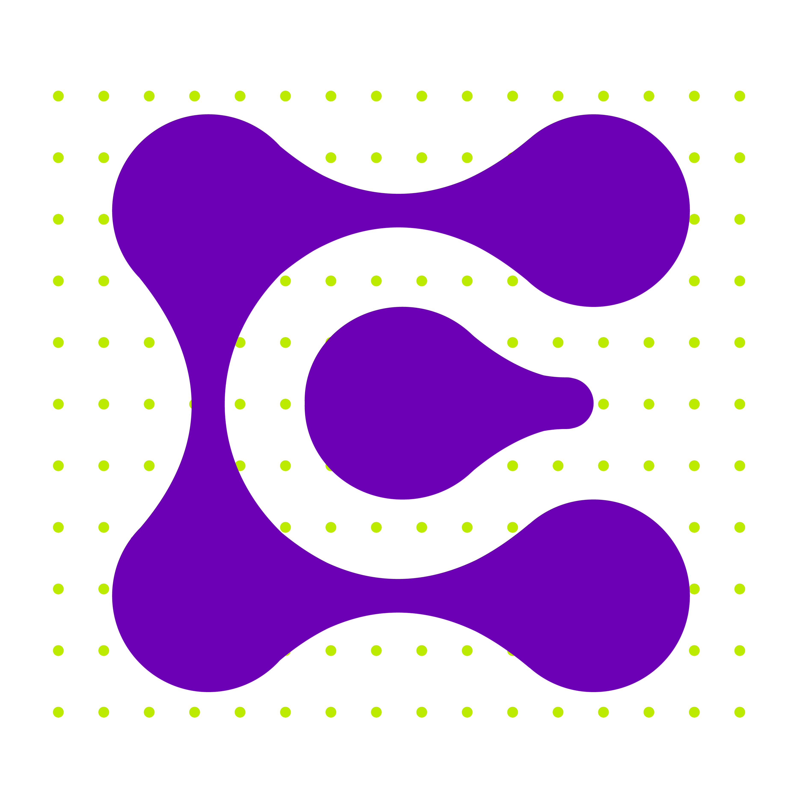

# La Ciénaga Labs



## Descripción

**La Ciénaga Labs** es una organización dedicada al desarrollo de proyectos científicos, tecnológicos y ambientales que impactan positivamente las comunidades. Nos especializamos en:

- 🧬 **Involucramiento científico comunitario**
- 🌱 **Búsqueda de impacto ecológico**
- 🔬 **Estudio de patógenos y análisis microbiológico**

## Servicios

### 🏗️ Creación de ecosistemas artificiales
Creamos ecosistemas artificiales controlados que permiten simular dinámicas ecológicas, evaluar impactos ambientales y optimizar proyectos de restauración con datos precisos y en tiempo real.

### 🎯 Estudios ambientales de precisión
Implementamos sistemas avanzados de recolección y análisis de datos para proyectos científicos y ambientales.

### 📊 Sensórica y monitoreo ambiental
Brindamos servicios de sensores y toma de datos para entornos rurales y urbanos, monitoreando ecosistemas y calidad ambiental.

## Tecnologías Utilizadas

- HTML5
- CSS3
- JavaScript
- Diseño Responsivo
- Google Fonts (Manrope, Poppins)

## Estructura del Proyecto

```
├── index.html          # Página principal
├── styles.css          # Estilos CSS
├── script.js           # Funcionalidad JavaScript
├── README.md           # Este archivo
└── assets/             # Imágenes y recursos
    ├── logos/          # Logotipos y isotipos
    ├── patterns/       # Patrones decorativos
    ├── gallery/        # Galería de imágenes
    └── icons/          # Iconos y elementos gráficos
```

## Instalación y Uso

1. Clona este repositorio:
```bash
git clone https://github.com/juankaz1/lacienaga-labs.git
```

2. Navega al directorio del proyecto:
```bash
cd lacienaga-labs
```

3. Abre `index.html` en tu navegador web o sirve el proyecto con un servidor local.

## Desarrollo Local

Para desarrollo local, puedes usar cualquier servidor HTTP simple:

```bash
# Con Python
python -m http.server 8000

# Con Node.js (si tienes http-server instalado)
npx http-server

# Con PHP
php -S localhost:8000
```

Luego visita `http://localhost:8000` en tu navegador.

## Contribuir

1. Fork el proyecto
2. Crea una rama para tu feature (`git checkout -b feature/AmazingFeature`)
3. Commit tus cambios (`git commit -m 'Add some AmazingFeature'`)
4. Push a la rama (`git push origin feature/AmazingFeature`)
5. Abre un Pull Request

## Licencia

Este proyecto está bajo la licencia MIT. Ver el archivo `LICENSE` para más detalles.

## Contacto

**La Ciénaga Labs**
- Sitio web: [lacienagalabs.com](https://lacienagalabs.com)
- Email: [afdiaz@lacienagalabs.com](mailto:afdiaz@lacienagalabs.com)
- GitHub: [github.com/juankaz1](https://github.com/juankaz1)

---

*Desarrollamos proyectos científicos, tecnológicos y ambientales que impactan positivamente las comunidades.* 